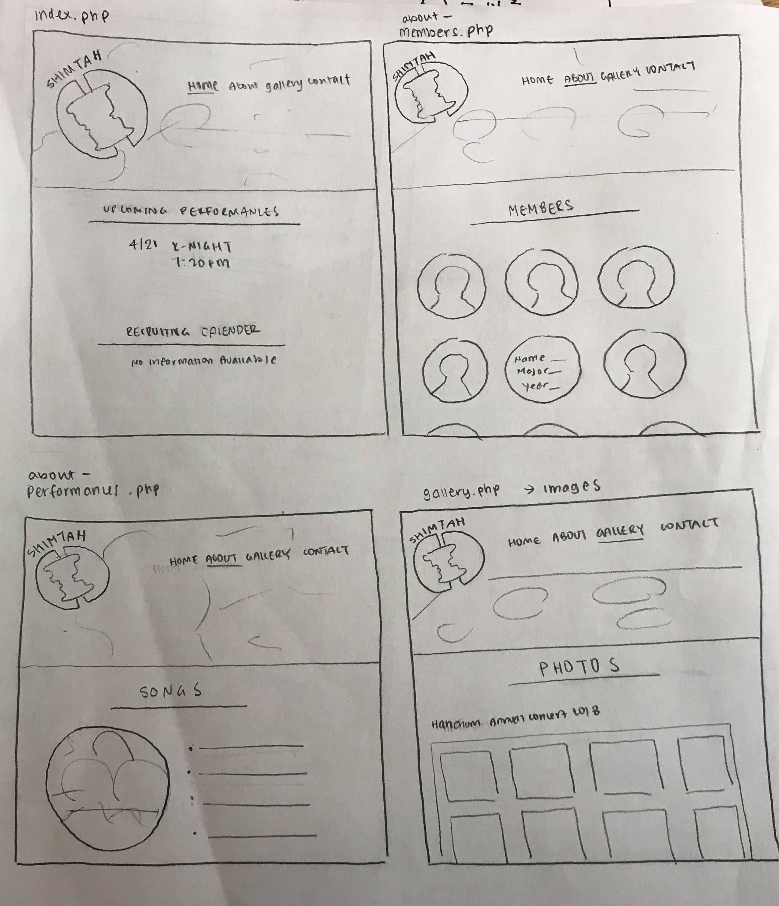
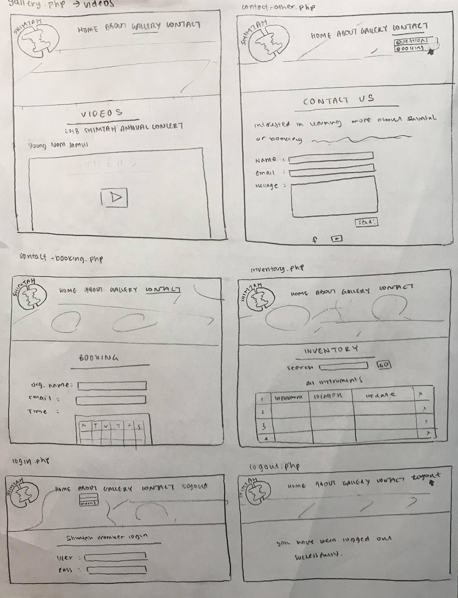
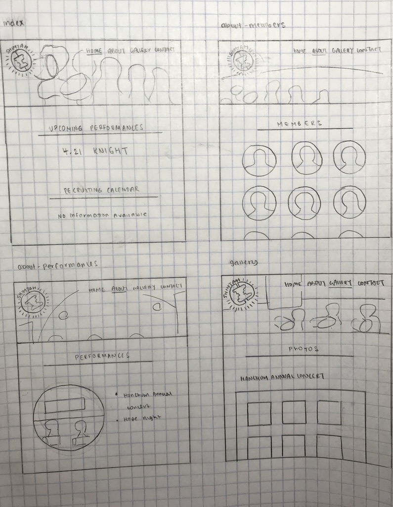
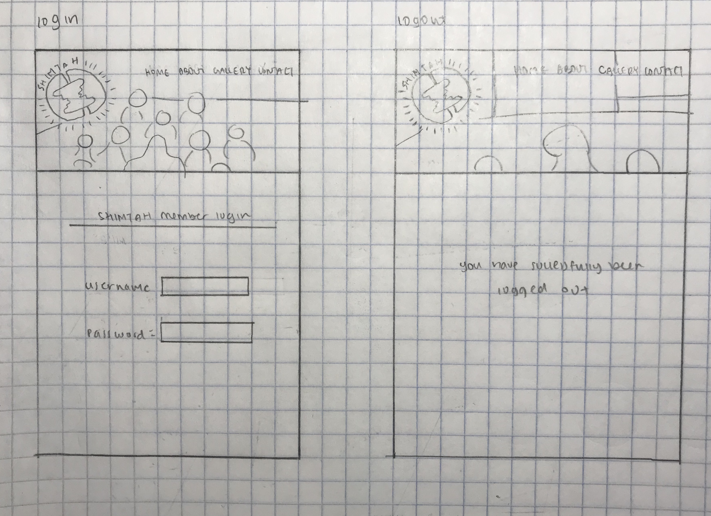

# Project 4 - Design & Plan

Your Team Name: Yellow Eagle

## Milestone 1, Part II: Client Selection

### Client Description

Our client is Shimtah, Cornell University's pungmul and Samul nori student group. They serve as Korean cultural ambassadors for the Ithaca and upstate New York communities. As Shimtah does not have an official website, they told us that they need a website which they can use as a channel to promote to and communicate with anyone who is interested in Pungmul/Samul or the club itself. They want the website gives a snapshot of what Shimtah is, What Pungmul & Samul nori is, What instruments are used to play such performances and promote the club and its upcoming performances. In addition to that, they also asked whether they can use the website as a tool to manage their membership & inventory database which used to be manually updated.


## Milestone 1, Part III: Client Requirements

### Target Audience(s)

There are three target audience groups for the website:
1. Shimtah members
The first target audience group is Shimtah members. This group of people will be able to log-in/out to the website and access to every information & feature of the website, including inventory information and membership update. Such features will only be available to members who log in with valid usernames and passwords, approved by admins. Inventory page shows up on the navigation bar only if a user successfully logs in.

2. Students who want to join Shimtah
The second target audience group is students who are interested in joining Shimtah or just want to know more about Shimtah. These people will get information about Shimtah, recruitment, upcoming performances, Pungmul, and Samul nori from the index page. They can also see pictures of Shimtah and watch Shimtah's previous performance videos on the gallery page. On the contact page, they can leave their name, email address, and any comment to get recruitment information or ask any inquiries to Shimtah e-board members. They do not need to log-in to get this information.

3. Event organizers
The third target group is any event organizers who want to invite Shimtah to their events for performance. Shimtah has been receiving event invitations through e-board members' emails, and it was not efficient since event teams contact different members of Shimtah e-board each time they send an invitation. Through contact page on the website, event organizers can easily send a performance invitation to Shimtah admin. This target group also does not need to have username/password to access the feature.


### Purpose & Content

The purpose of the website is to inform students on campus about what Shimtah is. Because the end goal is to enhance publicity, this website will include both text and visual components to showcase past performance and include information about their organization (members, about, etc.). In terms of content, the website will be catered to both themselves and their audience. Publicity-related content will include our main page index.php, about.php, and gallery.php, and contact.php, all of which can be accessed by prospective members. However, we will also have the inventory.php where current members can access an online database to keep track of their equipment. Moreover, the organization would also want to expand and attract new talent to their group. Thus, the website will include details about their recruitment cycle on their homepage.

### Needs and Wants

* 1. Database
Shimtah wants to keep track of the different instruments they currently have. Thus, a database with a full record of their existing inventory would help them achieve this need/ want. We will achieve this by creating a separate page for this database. However, this will only be accessible to current members, as we would not want outsiders manipulating information in the database. Thus, a login/ logout system will be implemented to ensure that the appropriate user can access info about their inventory. This will also require us to contact the organization to check how many/ what types of instruments they currently have.

* 2. Language Translation
Our client wants the website's main page (index.php) to be in both English and Korean. This is because Shimtah is an organization that attracts mainly Korean students, as it requires knowledge about the Korean traditional drums. In order to implement this, we will have one of our members (Korean) translate, and we will also use Google translation for support. Because we will only have the main homepage in dual languages, this shouldn't require too much time to manually translate.

* 3. Point of Contact
Our client wants/needs a contact form for both students and other on-campus organizations to contact them. They have two target audiences to fulfill two different needs. Students would be interested in contacting them for recruitment purposes, while organizations would be more interested in booking performances for events etc. In terms of the design, we will create a separate subpage (contact.php) where our contact form will be. Currently, we aren't sure whether we will include two forms for our separate user-groups or create a drop-down bar.

* 4. Visual Information
The most obvious need/want from our client was to increase publicity. Thus, they want a website with a lot of images and videos of their performances. In order to achieve this, we will include a separate gallery page (gallery.php) with images and videos. The organization will also have the ability to add and delete images, to keep their past/new performances up to date.

### Hosting Plan

We plan to host our client's site on Heroku as a PHP app.

### Client's Edits

Yes, the client will be able to edit the site after the end of the semester. The database will be editable through a form with fields to insert, delete, or update. The members page will be edited in a similar way to how we implemented the photo gallery in P3 - logged in members will be able to update the member images and descriptions or delete past members. For the rest of the content (just plain text or images), we will create a guide for the client on which pages contain what content and how to edit the content in the php file.

### Information Architecture, Content, and Navigation

* Content #1
  * **Main Navigation**
    * Home
    * About
    * Gallery
    * Contact
    * Inventory (only accessible to members who are logged in)
  * **Sub-Categories**
    * Members
    * Instruments
    * Songs/Performances
  * **Content** (List all the content corresponding to main navigation and sub-categories.)
    * *Home*: serves as a welcome page to the site, will display a large image of a performance
    with a short introduction to the organization below. This page will also have information
    about recruitment dates and upcoming performance dates;
    * *About*: hovering over this title in the nav bar will reveal a drop-down menu to three
    subcategories: Members, Instruments, and Songs/Performances
    * *Members*: will provide a short bio and photo of each member of Shimtah (there are about 25 members. We have requested these bios and photos from our client already and should have them soon. There will also be a link to login on this page. A user can click this link if they are a member and they will be brought to a login form.
    * *Instruments*: this page will showcase the different instruments used by Shimtah by providing a brief description and accompanying photo of each instruments
    * *Songs/Performances*: will give more information about the types of songs performed by
    Shimtah
    * *Gallery*: will provide both images and videos of performances that will be displayed in a
    gallery format. Videos can be accessed through Shimtah's Youtube page and we have requested
    high quality photos of performances from our client to show on this page
    * *Contact*: this page will contain two forms that can be used to contact Shimtah for two
    different purposes. One form will be aimed at prospective members who want more information
    about joining the organization or the recruitment process, and the other will be aimed
    at people interested in booking Shimtah for an event and will provide an easy way to begin
    a conversation. We haven't decided if we want these forms to be on one page together or if
    we want there to be a drop-down menu when a user hovers over Contact in the nav bar that will
    lead to different pages for each form
    * *Inventory*: this page will only be visible on the nav bar when a user is logged in. It will contain information about the status of instruments and other supplies used during performing. Information about this inventory will be stored in a database.


### Interactivity

  * *Login Form*: the login form will let members of Shimtah log in and gain access to the inventory database information. This connects to our client's want for the website to be a useful hub of information for its current members and will ensure that the login system unlocks extra functionality and has a genuine purpose.
  * *Language Change*: there will be a button on the home page that lets a user switch the language of this page from default English to Korean. This feature will cater to the key demographic of prospective students who are Korean and may prefer to consume information in their native language.
  * *Header Shows Current Page*: there will be some indication in the nav bar as to what page a user is currently on, like through bolding or underlining the page name. This feature will make the site more intuitive and easier to use. It will streamline navigation of the site and will make it more likely that a user would continue to explore the site rather than get confused and leave, which will contribute to the site's success in increasing awareness and publicity of the organization.

### External Code

We are not planning to incorporate any external code into our site at this time.

### Scale

The site will have 8 pages in total. We can't be sure about how many hours it will take to complete, but we estimate that it will be over 100 hours of work in total.

## Milestone 1, Part IV: Work Distribution

We've decided to assign each member 2-3 pages of the website to complete so that each member will contribute to both the design and code. This will also prevent us from overriding each other's code and having merge conflicts. Each week at our team meetings, we will make a list of tasks that need to be completed before the next meeting with due dates for each task. Design tasks will typically be due a few days before coding tasks so that our group follows the natural work flow of designing and editing before actually coding the site. All work for the milestone should be completed by 2:00 pm so that whoever is in charge of checking the submission for the week has time to verify that everything has been properly pushed to GitHub. Since our meetings are on Thursdays, we'll be discussing both the milestone due the following Tuesday and the milestone due the Tuesday after.
The pages are distributed as follows:
* index.php - Subin
* header.php - Sameena
* footer.php - Sameena
* init.php - Vivian
* members.php - Hye Jin
* songs.php - Hye Jin
* photos.php - Subin
* videos.php - Subin
* login.php - Vivian
* logout.php - Vivian
* inventory.php - Vivian

## Milestone 1, Part V: Additional Comments

None!

## Milestone 2, Part I: PHP Interactivity

We will have three features that utilize PHP interactivity. One of these features will be a login form. Visitors of the site who are members of Shimtah can log in and gain access to the inventory page. On this page, they will be able to see information about the current status of the different instruments. When a user is logged in, a button will be shown that says logout. We will also have a feature on the homepage that allows a user to switch languages from English to Korean. This information will be manually translated and will only be a feature on the homepage.
Another element of PHP interactivity will be in the nav bar. The current page a user is on will be detectable by some difference in style, like by having the page title bolded or underlined.

## Milestone 2, Part II: Sketches, Navigation & Wireframes

### Sketches




### Navigation

* Home: has English and Korean options to display general information about Shimtah
* About
  * Members: a list of all members in the org with their name, major, and year
  * Performances: a list of all performances done by Shimtah
* Gallery
  * Photos: photos of the members
  * Videos: links to Shimtah's performances
* Contact
  * Questions: for general inquiries
  * Booking:
* Member Resources
  * Login: Allows members to login
  * Inventory (must be logged in as a member): a table of all instruments and their locations; has a form where users can update the inventory
  * Logout (must be logged in as a member): directs user to logout


### Wireframes





## Milestone 2, Part III: Evaluate your Design

[Use the GenderMag method to evaluate your wireframes.]
[Pick a persona that you believe will help you address the gender bias within your design.]

We've selected **Abby** as our persona since Abby's perspective toward approaching new technologies is the most similar to that of majority of the population. In addition, her learning style and information processing style demand the most comprehensive explanations and design, so if Abby can appreciate my design then most other people will as well. We believed that creating a website that serves a persona like Abby would be most gender inclusive and fit to the majority of people.


### Tasks

[You will need to evaluate at least 3 tasks (known as scenarios in the GenderMag literature). List your tasks here. These tasks are the same as the task you learned in INFO/CS 1300.]

[For each task, list the ideal set of actions that you would like your users to take when working towards the task.]

Task 1: You want to schedule Shimtah for an event next month.

  1. Hover over contact.
  2. Click on bookings.
  3. Fill out form with information regarding potential event and date.
  4. Click submit.

Task 2: You want to check the inventory of the janggu.
  1. Click on log-in.
  2. Log in to the site.
  3. Click on inventory.
  4. Search for the janggu in the form.

Task 3: You are an international student from Korea, and you are interested in joining Shimtah. Since you are more comfortable with Korean, you want to check out Shimtah's information in Korean.
  1. Hover over language option button on the index page (the default page)
  2. Click "Korean" from the drop down bar.


### Cognitive Walkthrough

[Perform a cognitive walkthrough using the GenderMag method for all of your Tasks. Use the GenderMag template in the <documents/gendermag-template.md> file.]

#### Task 1 - Cognitive Walkthrough

[copy the GenderMag template here and conduct a cognitive walkthrough to evaluate your design (wireframes).]
[You may need to add additional subgoals and/or actions for each task.]

**Task name: You want to schedule Shimtah for an event next month.**

**Subgoal #1 : Find appropriate page in nav bar(contact)**

  - Will Abby have formed this sub-goal as a step to their overall goal?
    - Yes, maybe or no: Yes
    - Why? This is a natural first step in the booking process and would fit align
    with Abby's process-oriented learning style. Using a nav bar is a familiar feature
    that Abby is likely accustomed to from other websites.

**Action #1 : Hover mouse over contact in nav bar**

  - Will Abby know what to do at this step?
    - Yes, maybe or no: Yes
    - Why? She will have correctly identified which section in the nav bar already,
    the contact page. Since Abby has low confidence about her abilities, she will likely
    not immediately click on contact but rather will move her mouse over this part of the header.
    This will reveal two options from the drop down bar, Questions and Booking.

  - If Abby does the right thing, will she know that she did the right thing, and is making progress towards her goal?
    - Yes, maybe or no: Yes
    - Why? She will see two options to contact Shimtah, either Questions or Booking. Since she's
    interested in bookings, seeing this word will be a clear indicator that she is on the right path.
    Abby is risk-averse in how she uses technologies, so seeing this option clearly identified will give her
    confidence that she is making progress towards her goal before she has actually clicked on the page.

**Action #2 : Click on booking option from drop down menu**

  - Will Abby know what to do at this step?
    - Yes, maybe or no: Yes
    - Why? She has made the connection between this page and her goal so she'll be
    confident clicking this page. The menu labels the two options very clearly so Abby
    won't feel like she has to explore around to find her desired destination (a booking form),
    she will be sure she is making the correct next step.

  - If Abby does the right thing, will she know that she did the right thing, and is making progress towards her goal?
    - Yes, maybe or no: Yes
    - Why? Clicking on the booking option will bring Abby to a page that has a header that says something like
    "Book Shimtah for your next event!" She will read the information on the entire page, since she likes to
    process information comprehensively, and will come to the conclusion that she is in the right spot. The text
    on the page will make it very clear that the form is used to book Shimtah.

**Subgoal #2 : Fill out and submit form**

  - Will Abby have formed this sub-goal as a step to their overall goal?
    - Yes, maybe or no: Yes
    - Why? Abby has likely filled out a form before on a website so the form on this page will be very familiar looking. She won't look at it and think "What do I do with this?", the familiar formatting will remind her of past experiences and she will fill out the form with confidence.

**Action #1 : Type in information about booking**

  - Will Abby know what to do at this step?
    - Yes, maybe or no: Yes
    - Why? As mentioned before, Abby has probably been exposed to forms before
    and the booking form will look very similar to the average form. She'll
    understand that to utilize it, she'll need to type in some information.

  - If Abby does the right thing, will she know that she did the right thing, and is making progress towards her goal?
    - Yes, maybe or no: Yes
    - Why? This is a natural next step in the process of filling out a form. It's not a feature unique of technology. Abby knows that to communicate her needs she'll have to provide some information, just as she would need to in real life when completing a form.

**Action #2 : Click submit(or send)**

  - Will Abby know what to do at this step?
    - Yes, maybe or no: Yes
    - Why? Even if Abby doesn't know to click submit immediately once she's
      done with the form, if she doesn't do anything she'll take note that
      nothing on the page will have changed. She will use her logic skills and will
      understand that there must be another step to completing her goal,
      so she'll click on the aptly labeled "submit" button.

  - If Abby does the right thing, will she know that she did the right thing, and is making progress towards her goal?
    - Yes, maybe or no: Yes
    - Why? Once she clicks submit, Abby will see the success message screen, which will say something like
    "Your booking inquiry has been received." This will give her a clear indication that her task has been
    completed and there are no steps left in the process.

#### Task 2 - Cognitive Walkthrough
**Task name: You want to check the inventory of the janggu.**

**Subgoal # 1 : Login as a member of Shimtah**

  - Will Abby have formed this sub-goal as a step to their overall goal?
    - Yes, maybe or no: Maybe
    - Why? Assuming that members were told to log in before they could access the database, Abby may have formed this subgoal. However, if she forgot, she may skip this step and head directly to the inventory page because that's where her motivations lay in using the site.  

**Action # 1 : Click on login**

  - Will Abby know what to do at this step?
    - Yes, maybe or no: Maybe
    - Why? As stated in the subgoal, this depends on whether or not she is aware that she needs to log in to the site in order to check the inventory. Assuming she is aware she needs to login, then she would know what to do at this step because the login page is easy to access.

  - If Abby does the right thing, will she know that she did the right thing, and is making progress towards her goal?
    - Yes, maybe or no: Yes
    - Why? She'll see the login page, which means she'll know to move onto action 2.

**Action # 2 : Enter login information**

  - Will Abby know what to do at this step?
  - Yes, maybe or no: Yes
  - Why? There are only two fields on the login page: email and password, so Abby would not have to tinker with the page in order to complete this step.

  - If Abby does the right thing, will she know that she did the right thing, and is making progress towards her goal?
  - Yes, maybe or no: Yes
  - Why? She'll be able to click on the login button without any warning messages.

**Action # 3 : Click on the Login button**

  - Will Abby know what to do at this step?
  - Yes, maybe or no: Yes
  - Why? After filling out her information, the login button is below the textfields and is straightforward. Abby would not need to scroll around the page to figure out how to login with her information.

  - If Abby does the right thing, will she know that she did the right thing, and is making progress towards her goal?
  - Yes, maybe or no: Yes
  - Why? She'll see a message that she has been successfully logged in and will now have access to member pages on the website.

**Subgoal # 2 : Check the inventory of the janggu**

  - Will Abby have formed this sub-goal as a step to their overall goal?
  - Yes, maybe or no: Yes
  - Why? This is Abby's primary goal, and since she is on the site only to accomplish this task, she will not explore around the rest of the site. Abby will try to complete this task in the easiest way possible, without extra tinkering.

  **Action # 1 : Click on inventory**

    - Will Abby know what to do at this step?
      - Yes, maybe or no: Yes
      - Why? If a member isn't logged in, then the inventory page will link them to the log in page instead. Since Abby is already logged in, Abby will see and will know to click on the inventory page, since inventory implies that that's where the instrument information is stored.

    - If Abby does the right thing, will she know that she did the right thing, and is making progress towards her goal?
      - Yes, maybe or no: Yes
      - Why? Abby will be able to see the entire instruments database in the inventory page since she is logged in. There will also be a form that lets her search for instruments, allowing her to accomplish her task.

  **Action # 2 : Enter 'janggu' in the search form**

    - Will Abby know what to do at this step?
    - Yes, maybe or no: Yes
    - Why? The search form is easily accessible and self-explanatory. Abby will not have to learn any new softwares to accomplish this task.

    - If Abby does the right thing, will she know that she did the right thing, and is making progress towards her goal?
    - Yes, maybe or no: Yes
    - Why? Abby will be allowed to submit the form without any error messages.

  **Action # 3 : Click the 'Go' button**

    - Will Abby know what to do at this step?
    - Yes, maybe or no: Yes
    - Why? The button is placed right next to the search field and will clearly indicate that it will cause the form to send.

    - If Abby does the right thing, will she know that she did the right thing, and is making progress towards her goal?
    - Yes, maybe or no: Yes
    - Why? This is the last action and after Abby completes it, she will have completed her main task.


#### Task 3 - Cognitive Walkthrough
You are an international student from Korea, and you are interested in joining Shimtah. Since you are more comfortable with Korean, you want to check out Shimtah's information in Korean.

    **Task name: You are an international student from Korea, and you are interested in joining Shimtah. Since you are more comfortable with Korean, you want to check out Shimtah's information in Korean.**

    **Subgoal #1 : Find a language option on the main page**

      - Will Abby have formed this sub-goal as a step to their overall goal?
        - Yes, maybe or no: Yes
        - Why? Since Abby is an international student who is not fluent in English. Her prior needs would be to access the information on the website in her native language, Korean. Therefore, it might be a natural step for her to check whether the website has an another language option.

    **Action #1 : Hover mouse over contact in nav bar**

      - Will Abby know what to do at this step?
        - Yes, maybe or no: Yes
        - Why? She will have correctly identified the language option section on the main page. As mentioned above, Abby has low confidence about her abilities. Therefore, she will likely to hover over the language option drop-down, instead of just clicking it before knowing whether it is a drop down or a button. This action will reveal another language option, "Korean," from the drop down bar.

      - If Abby does the right thing, will she know that she did the right thing, and is making progress towards her goal?
        - Yes, maybe or no: Yes
        - Why? She will know that she has identified correctly on the language option. Hovering over the language option section, which was set on "English", a default language, will show her another option, "Korean". This will confirm her that she was right about hanging fluttering on the option to see what options it will give. It is also making progress towards her goal as she now know what to click on to achieve her goal.

    **Action #2 : Click "Korean" from the drop down bar.**

      - Will Abby know what to do at this step?
        - Yes, maybe or no: Yes
        - Why? Hovering over the option has shown her an option of Korean. With her common sense and logic, she will know that she needs to click "Korean" so that the website language setting changes in to Korean from English, which is the default setting.

      - If Abby does the right thing, will she know that she did the right thing, and is making progress towards her goal?
        - Yes, maybe or no: Yes.
        - Why? Once she clicks Korean, she will see the entire main page changed into Korean. And the language option button remains on "Korean" option. Abby is risk-averse in using technologies. Having an entire webpage in Korean is an enough indicator for her action. This action has accomplished her goal to see information in Korean.

### Cognitive Walk-through Results

#### Task 1 - Cognitive Walk-through Results

We had originally planned to make the contact page contain two forms, one for general questions and one for booking, but decided to change it to a dropdown menu before we started the cognitive walkthrough. We didn't discover any issues with our design while thinking of how Abby would complete this task after this change was made. However I think if we had conducted the CW prior to this alteration, Abby would've struggled more in reaching the end goal. She would've had less confidence clicking on a tab that wasn't as clearly labeled, so the seamlessness of the CW of the first task showed us that we made the right decision in separating the two contact forms.

#### Task 2 - Cognitive Walk-through Results

**Task 2**
From the second cognitive walkthrough task, we realized that Abby may not be aware that she needs to log in to the site before she can access the inventory page. We decided to have a dropdown on the nav bar for member-access pages, including login and inventory. The inventory page will redirect a user to login if there is no current user signed in, so either way, the user must log in before they can check the inventory.

#### Task 3 - Cognitive Walk-through Results

**Task 3**
We originally planned to have a button instead of dropdown bar for the language option. However, through the task 3 cognitive walkthrough, we figured that Abby might not know what the default setting is and how to change the language option. Therefore, we decided to change the button into dropdown feature so that Abby realizes that change within the dropdown will change the language setting of the website.

From the second cognitive walkthrough task, we realized that Abby may not be aware that she needs to log in to the site before she can access the inventory page. We decided to have a dropdown on the nav bar for member-access pages, including login and inventory. The inventory page will redirect a user to login if there is no current user signed in, so either way, the user must log in before they can check the inventory.

## Milestone 2, Part IV: Database Plan

### Database Schema

Table: users
* field 1: id INTEGER NOT NULL PRIMARY KEY AUTOINCREMENT UNIQUE
* field 3: email TEXT NOT NULL UNIQUE
* field 4: password (hashed) TEXT NOT NULL

Table: inventory
* field 1: id INTEGER NOT NULL PRIMARY KEY AUTOINCREMENT UNIQUE
* field 2: instrument type TEXT NOT NULL
* field 3: quantity INTEGER NOT NULL

Table: instruments
* field 1: id INTEGER NOT NULL PRIMARY KEY AUTOINCREMENT UNIQUE
* field 2: location TEXT NOT NULL

Table: inventory instrument
* field 1: id INTEGER NOT NULL PRIMARY KEY AUTOINCREMENT UNIQUE
* field 2: inventory id INTEGER NOT NULL
* field 3: instrument id INTEGER NOT NULL

Table: members
* field 1: id INTEGER NOT NULL PRIMARY KEY AUTOINCREMENT UNIQUE
* field 2: Name TEXT NOT NULL
* field 3: Year INTEGER NOT NULL
* field 4: Major TEXT NOT NULL
* field 5: File ext TEXT

### Database Queries

Display instruments table:
SELECT * FROM inventory WHERE instrument type = '%' :type '%'

Show individual instruments:
join inventory, instruments, inventory instruments, select instrument type and location

Add an instrument:
begin transaction
INSERT INTO instruments (location) VALUES (:location)
UPDATE inventory SET number = number + 1 WHERE instrument type = :instrumenttype
INSERT INTO inventory instrument (inventory id, instrument id) VALUES (:inventory id, instrument id)
-- get the last added id

Delete an instrument:
begin transaction
SELECT * FROM inventory instrument WHERE instrument id = :instrument id
DELETE FROM instruments WHERE id = :instrument id
DELETE FROM inventory instrument WHERE instrument id = :instrument id
UPDATE inventory SET number = number - 1 WHERE inventory id = :inventoryid

Check login:
SELECT * FROM users WHERE email = :email

Display members:
SELECT * FROM members

## Milestone 2, Part V: Structure and Pseudocode

### Structure

[List the PHP files you will have. You will probably want to do this with a bulleted list.]

* index.php - main page.
* includes/init.php - stuff that useful for every web page.
* includes/header.php - navigation bar that will be visible on every page
* includes/footer.php - footer that contains links to Shimtah's social media pages, will be included on every page
* performances.php - contains information about Shimtah's different types of performances
* members.php - shows photos and short descriptions about each of Shimtah's members
* inventory.php - links to database of inventory information. page is only accessible to users who have logged in.
* login.php - has form that lets members log in. Is located on inventory page if user is not already logged in. Otherwise,
the inventory page will display the inventory.
* logout.php - displayed in nav bar only when a user is already logged in. Clicking on it will log a user out and will display a goodbye message on the screen.
* photos.php - contains gallery of photos showcasing Shimtah's members and performances
* videos.php - contains videos of Shimtah Performances - **editted: we decided not to include video for the version for submission as it violates hotlink policy. However, we will deliver a website with embeded videos to our client.**
* contact-other.php - has a form designed to let interested users submit questions about Shimtah as an organization or its recruitment process
* contact-booking.php - has a form that lets other organizations or individuals book Shimtah for an upcoming event


### Pseudocode

[For each PHP file, plan out your pseudocode. You probably want a subheading for each file.]

#### index.php

```
Pseudocode for index.php...

current page id
include init.php
include header.php
include footer.php

code for language option drop-down

switch($_POST['lang']) {
    case 'en': $_SESSION['lang'] = 'English'; break;
    case 'kr': $_SESSION['lang'] = 'Korean'; break;
    default:   $_SESSION['lang'] = 'English'; break;
}   

```

#### includes/init.php

```
website title
pages array

messages = array to store messages for user
function record messages
function print messages

// DB helper functions (you do not need to write this out since they are provided.)
  function handle db error
  function exec_sql_query
  function open or init sqlite db
db = connect to db

function check login
  if isset cookie session
    set the session cookie
    get the user from the db
    return the username

function login
  if username and password
    SQL query to return *, check for an account with the username
    if username is valid, check if password is the same for that row (records['password'])
      if password isn't the same, push invalid username or password message
      else (user and pass match)
        set the cookie  
    else, push invalid username or password message

function logout
  if current user is logged in
    update the user's session to be null

check if we should login the user

```

#### includes/header.php
```
display image of Shimtah logo

loop through pages array with for loop
  foreach ($pages as $page_id => $page_name)

if current page is $page_id, change current page's css id
  else have css id be empty

echo each page name with respective styling (either with current page style or normal styling)

if $current_user
  echo logout button

```

#### includes/footer.php
```
displays Facebook and Youtube logos that reference Shimtah's social media pages
```

#### members.php
```
website title
pages array

HTML
include header.php
Insert member photos
  <div class="headshots">
  
  </div>

CSS
hover text over image
.img__wrap {
  position: relative;
}
.img__description {
  position: absolute;
  right: 0;
  visibility: hidden;
  opacity: 0;

PHP

db -> connect to db

if current user
  echo upload image form
  input type file
  sql insert into headshot images
if upload success
  echo 'upload successful'
else
  echo 'try again'


  if current user
    echo form and button to delete image
    exec_sql_query delete from headshots WHERE id = chosen member
  if delete success
    echo 'image deleted'
  else
    echo 'try again'


```

#### performances.php
```
website title
pages array

HTML
include header.php
list of Shimtah performances

```

#### photos.php
```
current page id
include init.php
include header.php
include footer.php

photos displayed in a chronological order.

```

#### videos.php
```
current page id
include init.php
include header.php
include footer.php

<html>
<iframe src="shimtah performance video url" allowfullscreen></iframe>

**editted: we decided not to include video for the version for submission as it violates hotlink policy. However, we will deliver a website with embeded videos to our client.
```

#### contact-bookings.php
```
PHP
  current page id
  include init.php
  filter input from booking form if the necessary portions are filled out

HTML
  include header.php

  contact form with fields for org name, email address, and date of event (possible in calendar format). Send to Shimtah's email
  address using post request

  include footer.php

```

#### contact-other.php
```
PHP
  current page id
  include init.php
  filter input from question form if the necessary portions are filled out

HTML
  include header.php

  contact form with fields for name, email address, and message. Send to Shimtah's email
  address using post request

  include footer.php

```

#### login.php
```
PHP
  current page id
  include init.php (validates user login, creates session)

HTML
  include header.php

  login form with username and password --> send to the same page using a post request, checks for login (in init.php)

  include footer.php
```

#### logout.php
```
PHP
  current page id
  include init.php --> has a function for logout
  run php code to log out

HTML
  include header.php

  if logout successful, record a message

  include footer.php
```

#### inventory.php
```
PHP
  current page id

  include init.php

HTML
  include header.php

  print messages
  if current user
    display the database
    form to search for items, add, update, or delete items from db
  else
    error message that this is members only

  include footer.php
```

## Milestone 2, Part VI: Additional Comments

We know our site is ambitious but we can do it! We'll scale back later if we find that it's too much work for this project.

## Milestone 3: Updates

[If you make any changes to your plan or design, make a list of the changes here.]
* Switched to PHP sessions, deleted session field from db
* On video page, we decided not to include videos for the version for submission as this violates hotlink policy. However, we will deliver a website with embedded Youtube videos to our client.

## Milestone 4: Updates

[If you make any changes to your plan or design based on your peers' feedback, make a list of the changes here.]
* Added a "members" table in the db to make it easier to display all member info in the "Members" page
* Added the korean language option to the server

## Milestone 5: Cognitive Walkthrough

[Copy your tasks here from Milestone 2. Update them if you need to and then conduct another cognitive walkthrough.]

#### Task 1 - Cognitive Walkthrough

**Task name: You want to schedule Shimtah for an event next month.**

**Subgoal #1 : Find appropriate page in nav bar(contact)**

  - Will Abby have formed this sub-goal as a step to their overall goal?
    - Yes, maybe or no: Yes
    - Why? Most websites Abby uses probably have a navigation bar of some sort. Ours looks pretty similar
    to this standard and Abby will understand that each heading corresponds to a different type of page.
    She will identify which heading most closely aligns with her goal and will decide that the Contact
    heading is where she needs to focus on.

**Action #1 : Hover mouse over contact in nav bar**

  - Will Abby know what to do at this step?
    - Yes, maybe or no: Yes
    - Why? As stated in the first cognitive walkthrough, Abby won't jump right in and immediately click
    on Contact as soon as she identifies it. Rather, she will take a slower approach and will begin to hover over it
    and see if any more options arise.

  - If Abby does the right thing, will she know that she did the right thing, and is making progress towards her goal?
    - Yes, maybe or no: Yes
    - Why? Two options will be reveals, Questions and Bookings. We added in a feature since our
    last cognitive walkthrough that makes the colors of these options change slightly when a user hovers over
    them. Since Abby is risk-averse, this will give her more confidence that these two different subheadings
    represent two separate pages and she will be able to then select the correct one.

**Action #2 : Click on booking option from drop down menu**

  - Will Abby know what to do at this step?
    - Yes, maybe or no: Yes
    - Why? The label on this subheader clearly identifies what the page will be for. Since it
    matches what her goal is, she will be confident in her decision to click it.

  - If Abby does the right thing, will she know that she did the right thing, and is making progress towards her goal?
    - Yes, maybe or no: Yes
    - Why? After Abby clicks on Booking, she will be brought to a page that reads, "Want Shimtah to appear
    at your next event? Fill out the form below!" This introduction makes it clear what the purpose of the form is.
    Since Abby likes to consume information comprehensively, she will likely read the entire page before
    moving forward. She will see that the button says "Request Booking" and will understand that the form is
    just for inquiries, not to definitively book Shimtah.

**Subgoal #2 : Fill out and submit form**

  - Will Abby have formed this sub-goal as a step to their overall goal?
    - Yes, maybe or no: Yes
    - Why? The form resembles forms on other websites and is extremely intuitive to fill out.
    Even though Abby has low confidence with technology, this process is one she has seen before
    and is accustomed to. She will know she has to fill out the form if she wants to get in contact
    with Shimtah about booking.

**Action #1 : Type in information about booking**

  - Will Abby know what to do at this step?
    - Yes, maybe or no: Yes
    - Why? Abby has been exposed to forms before and will know she has to type in her information.
    Clicking on any of the input boxes highlights the box in blue and reveals that one can
    type in the box, so it's pretty clear what she has to do next.

  - If Abby does the right thing, will she know that she did the right thing, and is making progress towards her goal?
    - Yes, maybe or no: Yes
    - Why? The form won't submit until Abby fills out all the forms, so she will have to type something in all
    the boxes. Abby will be sure that she did not do the right thing if she did not fill out all the boxes,
    so she will use her logic skills to come to the conclusion that she has to fill everything out.

**Action #2 : Click Request Booking**

  - Will Abby know what to do at this step?
    - Yes, maybe or no: Yes
    - Why? The Request Booking button appears like a button and darkens when you click on it. If
    Abby does not click on the button right away, she will take note that nothing on the screen changed and will
    understand that she has not finalized the request. Forms she's filled out in the past also have had a submit
    button of some type, so she will be on the look out for the button and will respond appropriately.

  - If Abby does the right thing, will she know that she did the right thing, and is making progress towards her goal?
    - Yes, maybe or no: Yes
    - Why? Once she clicks Request Booking, a success message that says "Your booking request has been received. We'll get back to you shortly." appears. This will give her the assurance she needs to be confident that the form
    went through and her request has been received.


#### Task 2 - Cognitive Walkthrough
**Task name: You want to check the inventory of the janggu.**

**Subgoal # 1 : Login as a member of Shimtah**

  - Will Abby have formed this sub-goal as a step to their overall goal?
    - Yes, maybe or no: Yes
    - Club members should be told that they must login before they can access the inventory.

**Action # 1 : Click on login**

  - Will Abby know what to do at this step?
    - Yes, maybe or no: Yes
    - Why? The login page is easy to access (under member resources) and does not require much navigation. Even if Abby clicks on the inventory page, she sees a login page and will understand that she must log in as a club member.

  - If Abby does the right thing, will she know that she did the right thing, and is making progress towards her goal?
    - Yes, maybe or no: Yes
    - Why? She'll see the login page, which means she'll know to move onto action 2.

**Action # 2 : Enter login information**

  - Will Abby know what to do at this step?
  - Yes, maybe or no: Yes
  - Why? There are only two fields on the login page: email and password, so Abby would not have to tinker with the page in order to complete this step.

  - If Abby does the right thing, will she know that she did the right thing, and is making progress towards her goal?
  - Yes, maybe or no: Yes
  - Why? She'll be able to click on the login button without any warning messages.

**Action # 3 : Click on the Login button**

  - Will Abby know what to do at this step?
  - Yes, maybe or no: Yes
  - Why? After filling out her information, the login button is below the textfields and is straightforward. Abby would not need to scroll around the page to figure out how to login with her information.

  - If Abby does the right thing, will she know that she did the right thing, and is making progress towards her goal?
  - Yes, maybe or no: Yes
  - Why? She'll see a message that she has been successfully logged in and will now have access to the inventory page on the website.

**Subgoal # 2 : Check the inventory of the janggu**

  - Will Abby have formed this sub-goal as a step to their overall goal?
  - Yes, maybe or no: Yes
  - Why? This is Abby's primary goal, and since she is on the site only to accomplish this task, she will not explore around the rest of the site. Abby will try to complete this task in the easiest way possible, without extra tinkering.

  **Action # 1 : Click on inventory**

    - Will Abby know what to do at this step?
      - Yes, maybe or no: Yes
      - Why? It is intuitive that "inventory" points to the club's inventory. Abby may think that inventory may encompass other things but it is the most logical page to click on if she wants to check the inventory of the janggu.

    - If Abby does the right thing, will she know that she did the right thing, and is making progress towards her goal?
      - Yes, maybe or no: Yes
      - Why? Abby will be able to see the entire instruments database in the inventory page since she is logged in. There will also be a form that lets her search for instruments, allowing her to accomplish her task.

  **Action # 2 : Enter 'janggu' in the search form**

    - Will Abby know what to do at this step?
    - Yes, maybe or no: Yes
    - Why? The search form is right on top of the page and is easy to use.

    - If Abby does the right thing, will she know that she did the right thing, and is making progress towards her goal?
    - Yes, maybe or no: Yes
    - Why? Abby will be allowed to submit the form without any error messages.

  **Action # 3 : Click the 'Search' button**

    - Will Abby know what to do at this step?
    - Yes, maybe or no: Yes
    - Why? The button is placed right next to the search field and will clearly indicate that it will cause the form to send.

    - If Abby does the right thing, will she know that she did the right thing, and is making progress towards her goal?
    - Yes, maybe or no: Yes
    - Why? This is the last action and after Abby completes it, she will have accomplished her main task.


#### Task 3 - Cognitive Walkthrough
You are an international student from Korea, and you are interested in joining Shimtah. Since you are more comfortable with Korean, you want to check out Shimtah's information in Korean.

    **Task name: You are an international student from Korea, and you are interested in joining Shimtah. Since you are more comfortable with Korean, you want to check out Shimtah's information in Korean.**

    **Subgoal #1 : Find a language option on the main page**

      - Will Abby have formed this sub-goal as a step to their overall goal?
        - Yes, maybe or no: Yes
        - Why? Since Abby is an international student who is not fluent in English. Her prior needs would be to access the information on the website in her native language, Korean. Therefore, it might be a natural step for her to check whether the website has an another language option.

    **Action #1 : Hover mouse over contact in nav bar**

      - Will Abby know what to do at this step?
        - Yes, maybe or no: Yes
        - Why? She will have correctly identified the language option section on the main page. As mentioned above, Abby has low confidence about her abilities. Therefore, she will likely to hover over the language option drop-down, instead of just clicking it before knowing whether it is a drop down or a button. This action will reveal another language option, "Korean," from the drop down bar.

      - If Abby does the right thing, will she know that she did the right thing, and is making progress towards her goal?
        - Yes, maybe or no: Yes
        - Why? She will know that she has identified correctly on the language option. Hovering over the language option section, which was set on "English", a default language, will show her another option, "Korean". This will confirm her that she was right about hanging fluttering on the option to see what options it will give. It is also making progress towards her goal as she now know what to click on to achieve her goal.

    **Action #2 : Click "Korean" from the drop down bar.**

      - Will Abby know what to do at this step?
        - Yes, maybe or no: Yes
        - Why? Hovering over the option has shown her an option of Korean. With her common sense and logic, she will know that she needs to click "Korean" so that the website language setting changes in to Korean from English, which is the default setting.

      - If Abby does the right thing, will she know that she did the right thing, and is making progress towards her goal?
        - Yes, maybe or no: Yes.
        - Why? Once she clicks Korean, she will see the entire main page changed into Korean. And the language option button remains on "Korean" option. Abby is risk-averse in using technologies. Having an entire webpage in Korean is an enough indicator for her action. This action has accomplished her goal to see information in Korean.

### Cognitive Walk-though Results

[Did you discover any issues with your design? What were they? How did you change your design to address the gender-inclusiveness bugs you discovered?]

[Your responses here should be very thorough and thoughtful.]

**Task 1**
The Contact header and subheaders are appropriately labeled and are distinct enough the users will be confident as to what the purpose of each is even before they click on the page. Each form is intuitive to use, matches the format of forms on other websites, and gives an assuring message when a form is submitted so that a user can be sure that their request or question was received.

**Task 2**
The website is designed well enough in a way that club members can easily access the information they are looking for in the inventory. Not only can they search, but they can also update the inventory.

**Task 3**
The label for language option is designed to be conspicuous, and the website in Korean serves the Korean international students well as it shows the translated page with same design and structure.

## Milestone 5: Final Notes to the Clients

[Describe in some detail what the client will do (or would have to do) in order to make this website go live. What is the deployment plan?]
We will deploy the website for the user on Heroku. They may want to pay for a new domain name.

[Include any other information that your client needs to know about your final website design. For example, what client wants or needs were unable to be realized in your final product? Why were you unable to meet those wants/needs?]
We met all of the client's demands for the website. Instead of allowing admin functions, however, we will write a document teaching the club president to edit the users and members in the database.

## Milestone 5: Final Notes to the Graders

1. 3 Strengths of the website
- Inventory
This page is definitely a strength because it enables current users to keep track of their equipment for logistical purposes. It is a very simple page and easy to navigate through. In other performance-based organizations, there have been cases where equipments were broken or went missing. By giving track of these issues, Shimtah can make sure that their equipments are working well/ in proper place before any performance.

- Having two different forms for Contact
Currently, our site has two forms. One for general questions, and one to schedule a performance with Shimtah. This allows us to satisfy two very distinct target audiences and consequently, expand our reach. By having a booking form, Shimtah can use this opportunity to perform during events at Cornell and raise awareness about their organization as a whole.

- Member page
The member page emphasizes one very important part of this organization: diversity of majors. While Shimtah is more popular among Koreans rather than Americans, the member page still showcases how members are studying a variety of subjects on campus. This also helps with publicity when attracting new members to join.

2. Things that don't work
N/A- All our implementations are functioning well

3. Improvements
- Add more Content
Shimtah is a relatively new organization. Thus, we would love to add more content to the website, such as images and videos. By doing so, we could help spread awareness about what they do as an organization, and potentially have more people come out for recruitment.
